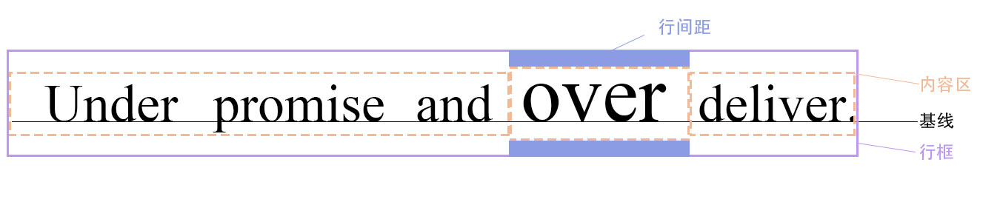

# 元素框

## 1. 水平格式化
### 非替换元素

- 七大元素：左外边距，左边框，左内边距，宽度，右内边距，右边框，右外边距

- 七大元素的和必须=父元素的width

- 只有width, margin-lft, margin-right可以设为auto，其余必须设特定的值，或者默认宽度为0；
- auto 弥补实际值与所需总和的差距；
- 如果magin和left都为非auto的值，即过分受限，那么会强制margin-right为auto；
- 如果3个属性都为0 ，那么外边距将会为0，width尽可能宽；

### 替换元素

如果替换元素的width设为auto，那么元素的宽度将会是内容的固有宽度。

比如，img标签的width设为auto，那么img元素的大小为原图片的大小

## 2. 垂直格式化

### auto高度
父元素的height设为auto，那么：

1. 如果无上下内边距和边框，height=最高的border-top到最低的border-bottom 

2. 如果有上下内边距或上下边框，height=最高的margin-top到最低的margin-bottom

### 合并垂直外边距
如果一个元素无内边距和边框，那么相邻的外边距会合并，两个外边距中较小的那个会被较大的合并。

## 3. 行内元素
复习：

1. em框：是字体实际大小和设计大小间的关系，实际的字形可能比em框更高或更矮；
2. 内容区：元素中各em框串在一起构成的框=固有高度+(外边距+边框+内边距)；
3. 行间距：font-size 减去 line-height；
4. 行内框：这个框通过向内容区增加行间距来描述；
5. 行框：行框的上边界要位于最高行内框的上边界，行框的底边要放在最低行内框的下边界。

- 内容区类似于块级元素的内容框
- 行内元素的背景应用于内容区及多有内边距
- 行内元素的边框包围内容区及所有内边距和边框

#### 如何确定高度
1. 确定各元素行内框的高度：
    - 得到文本的font-size值和inline-height值， 相减得到行间距，分一半应用到em框的顶部和底部
    - 得到各元素垂直方向的height,border,margin,padding值，加在一起
2. 
